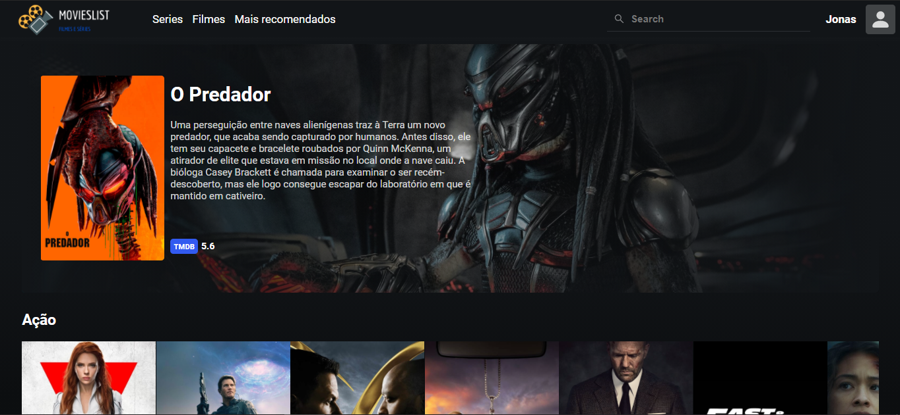

<!-- PROJECT LOGO -->
<br />
<p align="center">
  <h3 align="center">movielistList</h3>

  <p align="center">
    Site catalogo de filmes para consulta nele é possivel ver a nota do filme e sua sinopse
    <br />
  </p>
</p>


<!-- TABLE OF CONTENTS -->
<details open="open">
  <summary>Tópicos</summary>
  <ol>
    <li>
      <a href="#sobre-o-projeto">Sobre o projeto</a>
      <ul>
        <li><a href="#tecnologias-utilizadas">Tecnologias utilizadas</a></li>
      </ul>
    </li>
    <li>
      <a href="#como-instalar">Como instalar</a>
      <ul>
        <li><a href="#pre-requisitos">Pré-requisitos</a></li>
        <li><a href="#instalacao">Intalação</a></li>
      </ul>
    </li>
    <li><a href="#autor">Autor</a></li>
  </ol>
</details>


<!-- ABOUT THE PROJECT -->
## Sobre o projeto

<h1 align="center">
  
</h1>
<h1 align="center">
  
</h1>

Tela inicial com a exposição dos filmes recuperados da API pública The movie database

<h4 align="movielist"> 
	🚧 Site em construção... 🚧
  Em breve: MVC, Login, cadastro , avaliações
</h4>

### 🚀Tecnologias utilizadas

* [ReactJS](https://pt-br.reactjs.org/)
* [Figma](https://www.figma.com/)
* [TypeScript](https://www.typescriptlang.org/)
* [Api TMDB](https://developers.themoviedb.org/3/getting-started/introduction)

<!-- GETTING STARTED -->
## Como instalar 💻

### Pré-requisitos

Para a instalação da aplicação é necessário ter o Node instalado na sua máquina, já o yarn é opcional, segue os comandos para instalação atravé do terminal de comando:
* Node
* Npm ou Yarn


### Instalação

* Atráves do npm
  ```sh
  yarn
  ```
OU
* Atráves do yarn
  ```sh
  npm
  ```

Assim criará a pasta node_modules. Em seguida basta digitar:

   ```sh
   yarn start
   ```
OU 

   ```sh
   npm start
   ```

 ---
 ### ✨Autor

[Jonas de Souza](https://www.linkedin.com/in/jonas-de-souza-95091b186/)<br/>


[](https://www.linkedin.com/in/jonas-de-souza-95091b186/) 
[](mailto:joonascontato@gmail.com)
